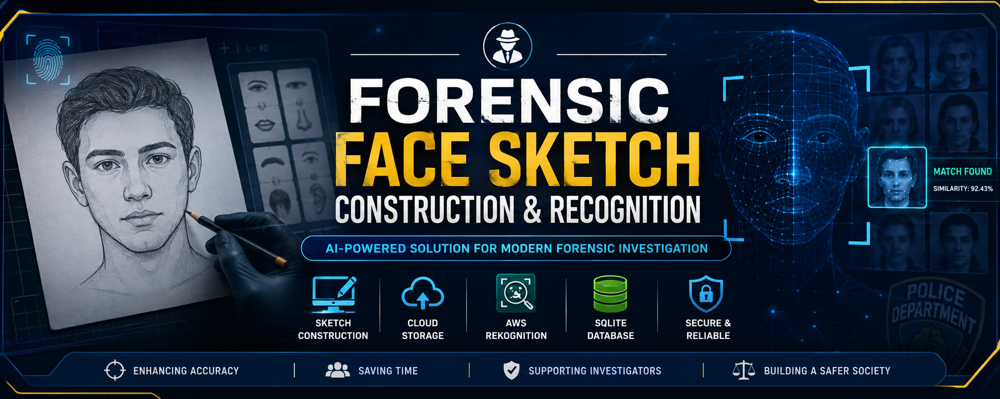

<p align="center">
  
</p>

 # 🔍 Forensic Face Sketch Construction and Recognition

<p align="center">
An AI-powered desktop application for constructing forensic face sketches and identifying suspects using JavaFX, AWS Rekognition, AWS S3, and SQLite.
</p>

<p align="center">


</p>

---

# 📑 Table of Contents

- Overview
- Objectives
- Features
- Technology Stack
- Repository Structure
- System Workflow
- Installation
- Documentation
- Future Enhancements
- Author

---

# 📖 Overview

Forensic Face Sketch Construction and Recognition is a desktop-based forensic application developed to assist law enforcement agencies in generating suspect face sketches and identifying potential matches using cloud-based facial recognition.

The project consists of two independent modules:

- **Sketch Builder** – JavaFX desktop application for creating facial sketches.
- **Face Recognition** – AWS Rekognition module used for identifying the closest facial match.

The system enables investigators to create sketches using facial components and compare them with stored facial images through Amazon Rekognition.

---

# 🎯 Objectives

- Digitally construct suspect face sketches.
- Improve forensic investigation efficiency.
- Integrate cloud-based facial recognition.
- Reduce manual identification effort.
- Provide an interactive desktop application.

---

# ✨ Features

- Interactive face sketch construction
- JavaFX desktop application
- Drag-and-drop facial component selection
- User authentication
- SQLite database integration
- AWS S3 cloud storage
- AWS Rekognition face matching
- Face comparison
- Modular project architecture
- Published journal paper
- Complete project documentation

---

# 🛠 Technology Stack

| Technology | Purpose |
|------------|---------|
| Java | Application Development |
| JavaFX | Desktop GUI |
| Scene Builder | UI Design |
| SQLite | Database |
| AWS S3 | Cloud Storage |
| AWS Rekognition | Face Recognition |
| Maven | Dependency Management |
| NetBeans IDE | Development Environment |

---

# 📂 Repository Structure

```text
Forensic-Face-Sketch-Recognition
│
├── SketchBuilder
│
├── FaceRecognition
│
├── docs
│   ├── Project_Report.pdf
│   └── Published_Paper_IJRDET.pdf
│
├── README.md
│
└── .gitignore
```

---

# 🔄 System Workflow

1. User Login
2. Face Sketch Construction
3. Sketch Generation
4. Upload Sketch to AWS S3
5. Face Matching using AWS Rekognition
6. Display Matching Results

---

# ⚙️ Installation

## Prerequisites

- Java JDK
- NetBeans IDE
- JavaFX SDK
- Maven
- AWS Account
- AWS S3 Bucket
- AWS Rekognition

## Steps

1. Clone the repository

```bash
git clone https://github.com/suhasgowda04/Forensic-Face-Sketch-Recognition.git
```

2. Open SketchBuilder in NetBeans.

3. Configure JavaFX SDK.

4. Configure AWS Credentials.

5. Run the SketchBuilder module.

6. Run the FaceRecognition module.


---

# 🚀 Usage

1. Launch the Sketch Builder application.
2. Log in with valid credentials.
3. Construct the suspect's face by selecting facial components.
4. Save the generated sketch.
5. Upload the sketch for face matching.
6. AWS Rekognition compares the sketch with stored facial records.
7. View the closest matching results.

---

# 📚 Documentation

The repository includes the following documentation:

📘 **Project Report**

- `docs/Project_Report.pdf`

📰 **Published Journal Paper**

- `docs/Published_Paper_IJRDET.pdf`

---

# 🔒 Security Features

- User Authentication
- Secure AWS Integration
- SQLite Database Management
- Cloud-based Face Recognition
- Role-based Application Workflow

---

# 🔮 Future Enhancements

- AI-assisted sketch generation
- Deep learning based face recognition
- Real-time CCTV integration
- Criminal database synchronization
- Mobile application support
- Multi-user authentication
- Performance optimization
- Enhanced facial component library

---

# 🤝 Contributing

Contributions are welcome.

To contribute:

1. Fork this repository.
2. Create a new branch.
3. Commit your changes.
4. Submit a Pull Request.

---

# 👨‍💻 Author

**Suhas D S**

Bachelor of Engineering (Information Science & Engineering)

Maharaja Institute of Technology, Mysore

GitHub: https://github.com/suhasgowda04

---

# 📄 License

This project is intended for academic and educational purposes.

---

# ⭐ Support

If you found this project useful, please consider giving it a ⭐ on GitHub.

---

# 🙏 Acknowledgements

- Maharaja Institute of Technology, Mysore
- Project Guide
- Amazon Web Services (AWS)
- JavaFX Community
- Open Source Community

---

> **Disclaimer:**  
> This repository is shared for academic and educational purposes. Sensitive information such as AWS credentials, configuration files, and confidential data has been removed before publication.